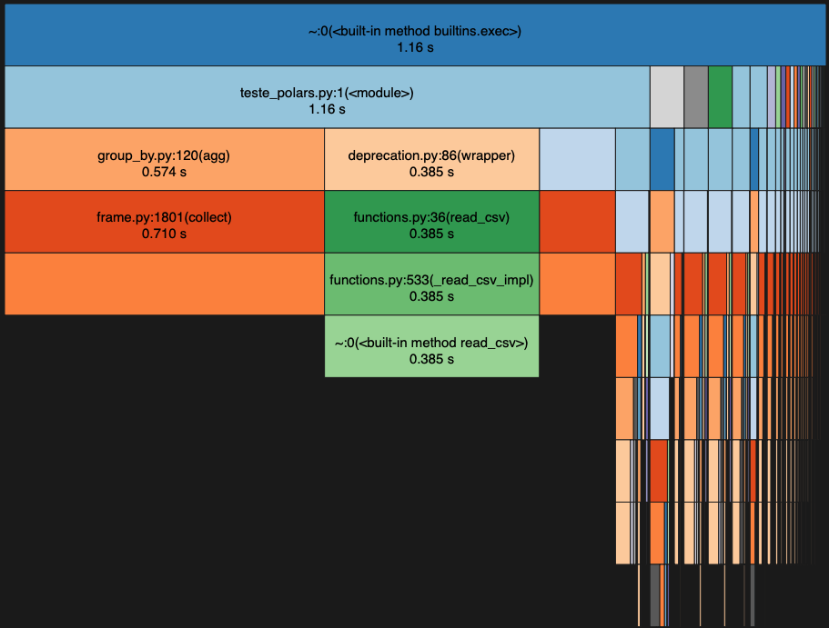
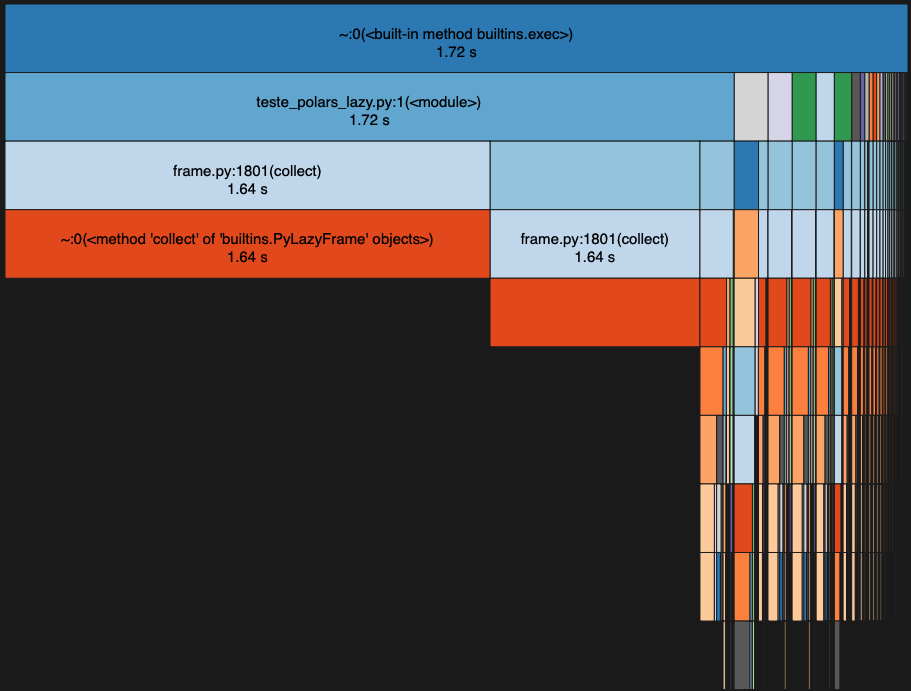
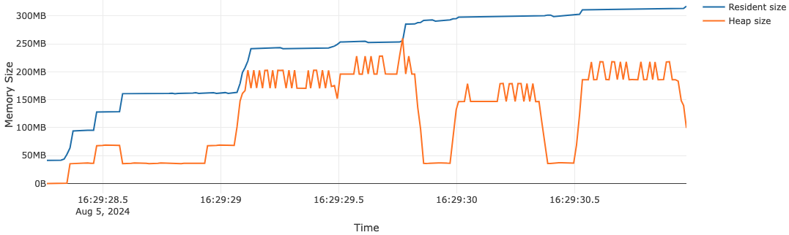
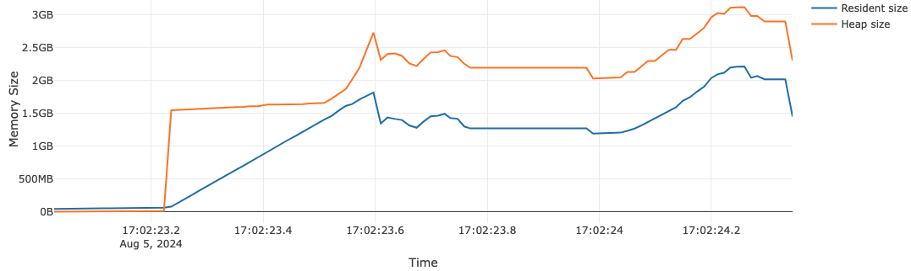
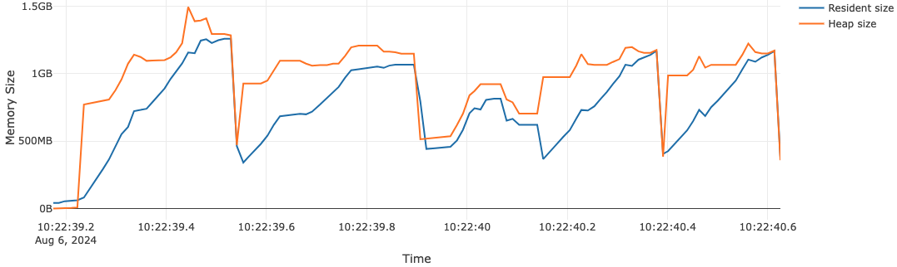

# Relatório

## Instruções
*Considerar apenas o arquivo* `teste_duckdb.py` para correção.
Instale as bibliotecas em um env, com `python3 -m pip install -r requirements.txt`

## Introdução

Testamos a leitura e processamento usando duas bibliotecas que tem sido mais eficientes do que Pandas em benchmarks recentes: DuckDB, um banco de dados analítico "in-process", e Polars, um novo DataFrame escrito em Rust.

Vamos começar por DuckDB. Como é "in-process", ele carrega os arquivos em memória; para evitar esse comportamento e permitir "larger-than-memory workloads" (`https://duckdb.org/docs/guides/performance/how_to_tune_workloads`), estabelecemos um `temp_directory`: assim os processos que excederem a memória do sistema são distribuídos pro disco.

No caso do Polars, apresento os resultados tanto para o modo "eager", quanto para o modo "lazy". No modo eager, a query é executada imediatamente, enquanto no modo lazy, ela é executada somente no momento final, quando "coletamos"; dessa maneira são feitas otimizações de leitura, como predicate e projection pushdowns. Apresentei os dois casos, porém somente o modo lazy com a opção de streaming é considerada oficial aqui, para nosso teste. Isto porque com o modo streaming podemos executar as queries em batches e consumir dados que excedem a memória disponível. Este é um modo ainda em desenvolvimento em Polars, e somente algumas operações estão disponíveis. No nosso caso, após avaliar os planos das queries, pude confirmar que todas operaçōes usadas rodaram em modo streaming.

O DuckDB foi o escolhido e selecionado para a submissão ao teste. Os resultados de Polars somente estão apresentados para comparação.

## Otimização

1. DuckDB

A única otimização feita foi para processar dados maiores do que a memória, usando: `duckdb.connect(config={"temp_directory": "./temp_dir.tmp/"})`. Testei o uso de customizar a opção de threads, porém para o meu caso não tive diferenças impactantes de desempenho.

2. Polars
    
Testei tanto o modo eager quanto o modo lazy com streaming ativado. Queria comparar o uso de memória e tempos de execução. O modo eager é mais veloz que o modo lazy, porém uso 2x mais memória no processo.

## Benchmarks de tempos de execução

O profiling foi feito usando a biblioteca `cProfile`, por meio do comando `python3 -m cProfile -o teste_polars_lazy.prof teste_polars_lazy.py`, por exemplo. A visualização dos resultados foi feita por meio da biblioteca `snakeviz`, usando o comando `python3 -m snakeviz teste_polars_lazy.prof`, por exemplo.

1. DuckDB

2. Polars Eager

3. Polars Lazy (streaming)

Resumo:
1. DuckDB: 1.62s
2. **Polars Eager**: **1.16s**
3. Polars Lazy: 1.72s

## Benchmarks de uso de memória

1. DuckDB

2. Polars Eager

3. Polars Lazy (streaming)

Resumo:
1. **DuckDB**: pico de **250 MB** em heap memory
2. Polars Eager: pico de +3 GB em heap memory
3. Polars Lazy: pico de 1.5 GB em heap memory

# Conclusão

Existe, como é conhecidamente, uma relação entre rapidez e uso de memória. DuckDB, ao usar a opção de direcionar dados para o disco caso esses ultrapassem o tamanho da memória, perde em tempo de execução para o Polars eager, no entanto em pés de igualdade com Polars lazy e streaming, é mais veloz que Polars e faz uso de 6x menos memória, sendo a melhor escolha.
Importante observar que DuckDB usa apenas 250 MB no pico, sendo que nosso arquivo analisado tem mais de 600 MB.